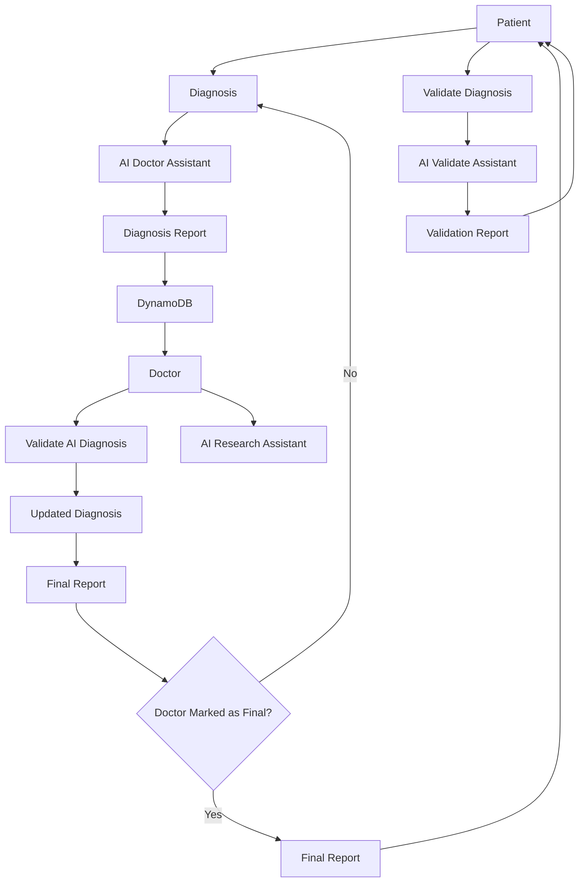

# Design Document

## Overview

The Rural Healthcare System is an AI-assisted diagnostic platform designed to address the healthcare challenges in rural India. The system leverages artificial intelligence to provide preliminary diagnoses while maintaining human oversight through qualified doctors. The architecture follows a microservices pattern with a central queue management system, multiple AI assistants, and secure data handling to ensure scalable and reliable healthcare delivery.

The system addresses the critical shortage of medical professionals in rural areas by providing immediate AI-powered diagnostic assistance, followed by professional medical validation, with an optional second opinion mechanism for patient confidence.

## Architecture

The system follows a distributed microservices architecture with the following key characteristics:

### High-Level Architecture



### Architectural Patterns

1. **Event-Driven Architecture**: The system uses asynchronous message passing through DynamoDB
2. **Microservices Pattern**: Each AI assistant and core component operates as an independent service
3. **Database-Based State Management**: DynamoDB manages diagnostic request state and workflow
4. **Validation Chain Pattern**: Multi-stage validation with AI and human oversight
5. **Optional Enhancement Pattern**: Second opinion validation as an optional patient-requested service

## Components and Interfaces

### Core Components

#### 1. DynamoDB Data Service
- **Purpose**: Central data storage and state management for diagnostic requests and reports
- **Responsibilities**:
  - Persistent storage of diagnostic requests, reports, and patient data
  - Request status tracking and workflow state management
  - Query support for retrieving reports by status, priority, or doctor assignment
  - Performance monitoring and metrics collection
  - Data indexing for efficient retrieval and prioritization

**Interface**:
```python
class DynamoDBService:
    def create_diagnosis_request(self, patient_data: PatientData) -> str
    def store_diagnosis_report(self, diagnosis_report: DiagnosisReport) -> bool
    def get_pending_reports_for_doctor(self, doctor_id: str) -> List[DiagnosisReport]
    def update_report_status(self, report_id: str, status: ReviewStatus) -> bool
    def query_reports_by_priority(self, priority: Priority) -> List[DiagnosisReport]
    def get_patient_history(self, patient_id: str) -> List[DiagnosisReport]
```

#### 2. AI Doctor Assistant Service
- **Purpose**: Primary diagnostic analysis and recommendation generation
- **Responsibilities**:
  - Symptom analysis and pattern recognition
  - Preliminary diagnosis generation with confidence scores
  - Risk assessment and urgency classification
  - Treatment recommendation suggestions

**Interface**:
```python
class AIDoctorAssistant:
    def analyze_symptoms(self, symptoms: List[Symptom]) -> DiagnosisAnalysis
    def generate_diagnosis(self, patient_data: PatientData) -> DiagnosisReport
    def assess_urgency(self, symptoms: List[Symptom]) -> UrgencyLevel
    def suggest_treatments(self, diagnosis: Diagnosis) -> List[Treatment]
```

#### 3. AI Validate Assistant Service
- **Purpose**: Second opinion validation for patient-requested reviews
- **Responsibilities**:
  - Analysis of doctor-approved final reports
  - Quality assessment of diagnosis and treatment recommendations
  - Identification of potential concerns or missing considerations
  - Generation of validation reports for patient review

**Interface**:
```python
class AIValidateAssistant:
    def validate_diagnosis(self, final_report: FinalReport) -> ValidationReport
    def analyze_diagnosis_quality(self, diagnosis: Diagnosis, symptoms: List[Symptom]) -> QualityAssessment
    def identify_potential_issues(self, final_report: FinalReport) -> List[ValidationConcern]
    def generate_validation_summary(self, validation_results: ValidationResults) -> ValidationReport
```

#### 4. AI Research Assistant Service
- **Purpose**: Research support for doctors during diagnosis review
- **Responsibilities**:
  - Medical literature search and retrieval
  - Evidence-based treatment recommendations
  - Drug interaction and contraindication checking
  - Differential diagnosis support

**Interface**:
```python
class AIResearchAssistant:
    def search_literature(self, query: MedicalQuery) -> List[ResearchPaper]
    def get_treatment_guidelines(self, condition: MedicalCondition) -> TreatmentGuidelines
    def check_drug_interactions(self, medications: List[Medication]) -> InteractionReport
    def suggest_differential_diagnoses(self, symptoms: List[Symptom]) -> List[DifferentialDiagnosis]
```

#### 5. Doctor Review Service
- **Purpose**: Human oversight and final medical approval
- **Responsibilities**:
  - AI diagnosis review and validation
  - Medical decision making and modifications
  - Patient communication and feedback collection
  - Quality assurance and continuous improvement

**Interface**:
```python
class DoctorReviewService:
    def review_diagnosis(self, diagnosis_report: DiagnosisReport) -> ReviewResult
    def modify_diagnosis(self, original: Diagnosis, modifications: DiagnosisModifications) -> UpdatedDiagnosis
    def approve_diagnosis(self, diagnosis: Diagnosis) -> FinalReport
    def request_patient_feedback(self, patient_id: str, questions: List[str]) -> FeedbackRequest
```

## Data Models

### Core Data Structures

#### Patient Data Model
```python
@dataclass
class PatientData:
    patient_id: str
    demographics: Demographics
    symptoms: List[Symptom]
    medical_history: MedicalHistory
    current_medications: List[Medication]
    vital_signs: VitalSigns
    language_preference: str
    timestamp: datetime
```

#### Diagnosis Models
```python
@dataclass
class Symptom:
    description: str
    severity: int  # 1-10 scale
    duration: timedelta
    onset_type: OnsetType  # gradual, sudden, intermittent
    associated_factors: List[str]

@dataclass
class Diagnosis:
    condition_name: str
    confidence_score: float  # 0.0-1.0
    icd_code: str
    description: str
    recommended_actions: List[str]
    urgency_level: UrgencyLevel
    differential_diagnoses: List[str]

@dataclass
class DiagnosisReport:
    request_id: str
    patient_id: str
    primary_diagnosis: Diagnosis
    alternative_diagnoses: List[Diagnosis]
    ai_confidence: float
    generated_timestamp: datetime
    ai_model_version: str
```

#### Validation and Review Models
```python
@dataclass
class ValidationReport:
    validation_id: str
    final_report_id: str
    patient_id: str
    validation_summary: str
    agreement_level: ValidationAgreement  # AGREE, PARTIAL_AGREE, DISAGREE
    identified_concerns: List[ValidationConcern]
    confidence_assessment: float  # 0.0-1.0
    recommendations: List[str]
    validation_timestamp: datetime
    ai_validator_version: str

@dataclass
class ValidationConcern:
    concern_type: ConcernType  # DIAGNOSTIC_ACCURACY, TREATMENT_APPROPRIATENESS, MISSING_CONSIDERATIONS
    severity: ConcernSeverity  # LOW, MEDIUM, HIGH, CRITICAL
    description: str
    supporting_evidence: List[str]

@dataclass
class FinalReport:
    report_id: str
    patient_id: str
    original_ai_diagnosis: Diagnosis
    doctor_modifications: Optional[DiagnosisModifications]
    final_diagnosis: Diagnosis
    doctor_comments: str
    approval_timestamp: datetime
    doctor_id: str
```

### Queue and Workflow Models
```python
@dataclass
class DiagnosisRequest:
    request_id: str
    patient_data: PatientData
    priority: Priority  # urgent, high, normal, low
    status: RequestStatus  # queued, processing, completed, failed
    created_timestamp: datetime
    assigned_services: List[str]

class RequestStatus(Enum):
    QUEUED = "queued"
    AI_PROCESSING = "ai_processing"
    DOCTOR_REVIEW = "doctor_review"
    VALIDATION_REQUESTED = "validation_requested"
    COMPLETED = "completed"
    FAILED = "failed"
```

Now I need to use the prework tool to analyze the acceptance criteria before writing the correctness properties:

<function_calls>
<invoke name="prework">
<parameter name="featureName">rural-healthcare-system

## Correctness Properties

*A property is a characteristic or behavior that should hold true across all valid executions of a system—essentially, a formal statement about what the system should do. Properties serve as the bridge between human-readable specifications and machine-verifiable correctness guarantees.*

Based on the prework analysis, the following properties ensure the system behaves correctly across all valid inputs and scenarios:

### Property 1: Request Creation Completeness
*For any* valid patient data submission, the system should create a diagnostic request in the queue with a unique identifier and timestamp.
**Validates: Requirements 1.1, 1.2**

### Property 2: Input Validation Consistency
*For any* incomplete patient data, the system should prompt for missing required information and not proceed until complete.
**Validates: Requirements 1.3**

### Property 3: Multilingual Processing
*For any* symptom description in supported languages (Hindi, English, regional languages), the system should process and understand the input correctly.
**Validates: Requirements 1.4, 7.5**

### Property 4: Wait Time Provision
*For any* patient request submission, the system should provide a valid estimated wait time for preliminary diagnosis.
**Validates: Requirements 1.5**

### Property 5: AI Diagnosis Generation
*For any* valid diagnostic request, the AI Doctor Assistant should generate preliminary diagnosis suggestions with confidence levels.
**Validates: Requirements 2.1, 2.2**

### Property 6: Diagnosis Completeness
*For any* generated diagnosis, the system should include recommended actions, precautions, and proper ranking when multiple conditions are identified.
**Validates: Requirements 2.3, 2.4, 2.5**

### Property 7: Optional Validation Availability
*For any* final report generated by a doctor, the system should offer patients the option to request AI validation.
**Validates: Requirements 3.1**

### Property 8: Validation Report Generation
*For any* patient-requested validation, the AI Validate Assistant should analyze the final report and provide a validation report with quality assessment and identified concerns.
**Validates: Requirements 3.2, 3.3, 3.4**

### Property 9: Doctor Review Data Access
*For any* AI-generated diagnosis report, the system should store it in DynamoDB and make it available to doctors with complete information including original symptoms, AI analysis, and research assistant access.
**Validates: Requirements 4.1, 4.2**

### Property 10: Doctor Modification Capability
*For any* diagnosis under doctor review, the system should allow approval or modification with comments and optional patient feedback requests.
**Validates: Requirements 4.3, 4.4, 4.5**

### Property 11: Research Assistant Functionality
*For any* doctor research request, the AI Research Assistant should provide relevant literature, guidelines, differential diagnoses, and safety checks.
**Validates: Requirements 5.1, 5.2, 5.3, 5.4, 5.5**

### Property 12: Data-Based Prioritization
*For any* set of diagnostic requests in DynamoDB, the system should prioritize based on symptom severity and escalate critical cases immediately.
**Validates: Requirements 6.1, 6.2**

### Property 13: Load Balancing
*For any* system load condition, the system should distribute work evenly across available resources and provide accurate wait times when capacity is exceeded.
**Validates: Requirements 6.3, 6.4**

### Property 14: Language Consistency
*For any* patient session with a selected language, the system should maintain that language throughout and provide appropriate translations.
**Validates: Requirements 7.2, 7.3, 7.4**

### Property 15: Security and Audit
*For any* patient data operation, the system should use encryption, require proper authentication, and maintain audit logs.
**Validates: Requirements 8.1, 8.2, 8.3, 8.4**

## Error Handling

### Error Categories and Responses

#### 1. Input Validation Errors
- **Invalid Patient Data**: Return structured error messages with specific field requirements
- **Unsupported Language**: Gracefully fallback to English with notification
- **Missing Critical Information**: Block processing and request required data

#### 2. AI Service Errors
- **AI Model Unavailable**: Queue request for retry with exponential backoff
- **Low Confidence Diagnosis**: Flag for immediate doctor review
- **Processing Timeout**: Escalate to human review with partial results if available

#### 3. System Integration Errors
- **DynamoDB Service Failure**: Implement circuit breaker pattern with local caching and retry logic
- **Database Connectivity**: Use cached data where possible, queue writes for retry
- **External API Failures**: Graceful degradation with reduced functionality

#### 4. Security and Compliance Errors
- **Authentication Failure**: Block access and log security event
- **Data Encryption Error**: Fail secure, do not process unencrypted data
- **Audit Log Failure**: Alert administrators, consider service degradation

### Error Recovery Strategies

1. **Graceful Degradation**: Maintain core functionality even when auxiliary services fail
2. **Retry Mechanisms**: Exponential backoff for transient failures
3. **Circuit Breakers**: Prevent cascade failures in distributed system
4. **Fallback Procedures**: Manual processes when automated systems fail
5. **Data Consistency**: Ensure patient data integrity during error conditions

## Testing Strategy

### Dual Testing Approach

The system requires both unit testing and property-based testing to ensure comprehensive coverage:

**Unit Tests**: Verify specific examples, edge cases, and error conditions
- Integration points between microservices
- Specific medical scenarios and edge cases
- Error handling and recovery procedures
- Security and authentication mechanisms

**Property Tests**: Verify universal properties across all inputs
- Data flow correctness across the entire diagnostic pipeline
- DynamoDB query and storage behavior under various load conditions
- Multi-language processing consistency
- Security and encryption properties

### Property-Based Testing Configuration

- **Testing Framework**: Use Hypothesis (Python) for property-based testing
- **Test Iterations**: Minimum 100 iterations per property test
- **Test Tagging**: Each property test must reference its design document property
- **Tag Format**: **Feature: rural-healthcare-system, Property {number}: {property_text}**

### Testing Environments

1. **Unit Testing Environment**: Isolated service testing with mocked dependencies
2. **Integration Testing Environment**: Full system testing with real service interactions
3. **Load Testing Environment**: Performance and scalability validation
4. **Security Testing Environment**: Penetration testing and vulnerability assessment

### Medical Domain Testing Considerations

- **Clinical Validation**: Collaborate with medical professionals for test case validation
- **Regulatory Compliance**: Ensure tests cover healthcare data protection requirements
- **Multi-language Testing**: Validate functionality across all supported languages
- **Edge Case Coverage**: Test rare medical conditions and unusual symptom combinations
- **Performance Testing**: Validate response times meet healthcare urgency requirements

The testing strategy ensures that the system maintains medical accuracy, regulatory compliance, and operational reliability while serving the critical healthcare needs of rural India.